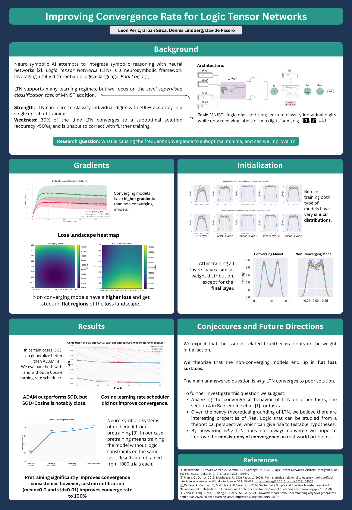

# Improving Convergence Rate for Logic Tensor Networks

This repository accompanies the research project **“Improving Convergence Rate for Logic Tensor Networks (LTNs)”**, summarized in the poster above.  
The project investigates why LTNs frequently converge to suboptimal minima when trained on semi-supervised classification tasks and explores methods to improve their convergence reliability.

---

## Overview

**Logic Tensor Networks (LTNs)** are a neuro-symbolic AI framework that combines first-order logic with neural networks through a differentiable logical language called **Real Logic**.

We focus on a **semi-supervised MNIST addition task**, where the model must classify individual digits while only receiving supervision on the *sum* of two digits.

### Key Findings

- About **30% of LTN runs converge to poor solutions** (accuracy < 50%).
- Successful training runs maintain **higher gradient magnitudes**.
- Non-converging runs fall into **flat regions** of the loss landscape.
- ADAM generally outperforms SGD, though SGD can generalize better in specific setups.
- Cosine learning-rate scheduling did not provide meaningful improvements.
- Initialization distributions are similar before training — divergence occurs mainly in the **final layer**.
- **Pretraining with the normal (non-logic) loss significantly improved convergence consistency**.
- **Initializing model parameters with a larger standard deviation made the model converge *100% of the time*** — the most reliable improvement observed.
- These findings are **relevant for real-world neuro-symbolic applications**, where consistent convergence is essential.

---
